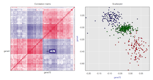
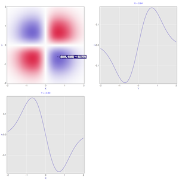
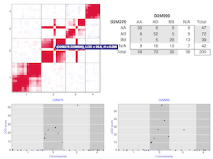
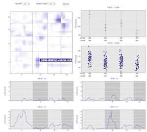

R/qtlcharts is an [R](http://www.r-project.org) package to create
interactive charts for QTL data, for use
with [R/qtl](http://www.rqtl.org).

A QTL is a _quantitative trait locus_: a genetic locus that
contributes to variation in a quantitative trait. The
goal of R/qtlcharts is to provide interactive data visualizations for QTL
analyses, and to make these visualizations available from [R](http://www.r-project.org).

The interactive visualizations are built with the JavaScript library
[D3](http://d3js.org), and are viewed in a web browser. We are
targeting Chrome and Safari and, as much as possible, Firefox.

A set of [reusable graphics panels](pages/panels.html) form the basis
for the larger visualizations.

---

- [Installation](pages/installation.html)
- [User guide](assets/vignettes/userGuide.html)
- [Developer guide](assets/vignettes/develGuide.html)
- [Reusable graphic panels](pages/panels.html)
- [Use with R Markdown](assets/vignettes/Rmarkdown.html)
- [List of chart customization options](assets/vignettes/chartOpts.html)

---

### Example charts

Click on a chart for the corresponding interactive version.

<link href="assets/css/image_table.css" rel="stylesheet" />

|                                                                                                                   |                                                                                                       |
| :---------------------------------------------------------------------------------------------------------------: | :---------------------------------------------------------------------------------------------------: |
|     |  |
|  |     |
|        |     |
|                 |        |
|     |                                                                                  |

---

Sources on [github](http://github.com):

- The [source for the package](https://github.com/kbroman/qtlcharts/tree/master)
- The [source for the website](https://github.com/kbroman/qtlcharts/tree/gh-pages)
