<a href="https://github.com/kbroman/qtlcharts">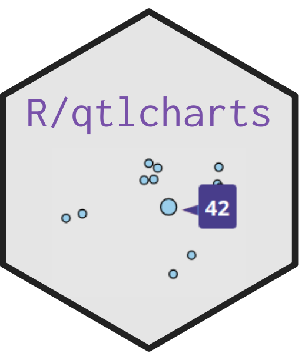</a>

R/qtlcharts is an [R](https://www.r-project.org) package to create
interactive charts for QTL data, for use
with [R/qtl](https://rqtl.org).

A QTL is a _quantitative trait locus_: a genetic locus that
contributes to variation in a quantitative trait. The
goal of R/qtlcharts is to provide interactive data visualizations for QTL
analyses, and to make these visualizations available from [R](https://www.r-project.org).

The interactive visualizations are built with the JavaScript library
[D3](https://d3js.org) (version 7) and are viewed in a web
browser or with [RStudio](https://rstudio.com/).

A set of [reusable graphics panels](https://kbroman.org/d3panels/) form the basis
for the larger visualizations.

To cite R/qtlcharts in publications, please use

> Broman KW (2015) R/qtlcharts: interactive graphics for quantitative
> trait locus mapping. Genetics 199:359-361.
> [`doi:10.1534/genetics/114.172742`](https://doi.org/10.1534/genetics.114.172742)

---

- [Installation](pages/installation.html)
- [User guide](assets/vignettes/userGuide.html)
- [Developer guide](assets/vignettes/develGuide.html)
- [d3panels](https://kbroman.org/d3panels/): reusable graphic panels
- [Use with R Markdown](assets/vignettes/Rmarkdown.html) [[Rmd source](https://github.com/kbroman/qtlcharts/blob/main/vignettes/Rmarkdown.Rmd)]
- [List of chart customization options](assets/vignettes/chartOpts.html)
- [Examples of use with Shiny](https://github.com/kbroman/shiny_qtlcharts)
- [Examples of use with Jupyter notebooks](https://github.com/kbroman/jupyter_qtlcharts)

---

### Example charts

Click on a chart for the corresponding interactive version.

<table class="wide">
<tr>
  <td class="left">
    <a href="example/iplotScanone.html">
        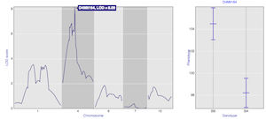
    </a>
  </td>
  <td class="right">
    <a href="example/iplotCorr.html">
        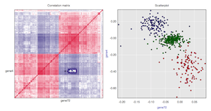
    </a>
  </td>
</tr>
<tr>
  <td class="left">
    <a href="example/iplotMScanone.html">
        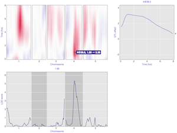
    </a>
  </td>
  <td class="right">
    <a href="example/iplotMap.html">
        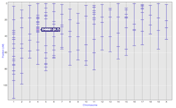
    </a>
  </td>
</tr>
<tr>
  <td class="left">
    <a href="example/iplotCurves.html">
        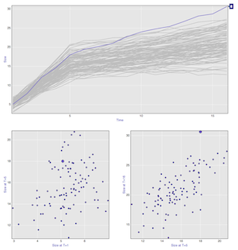
    </a>
  </td>
  <td class="right">
    <a href="example/iheatmap.html">
        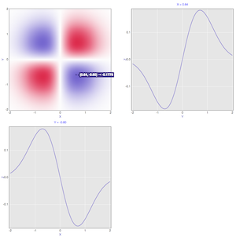
    </a>
  </td>
</tr>
<tr>
  <td class="left">
    <a href="example/iboxplot.html">
        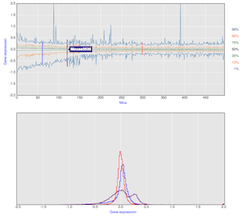
    </a>
  </td>
  <td class="right">
    <a href="example/iplotRF.html">
        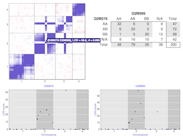
    </a>
  </td>
</tr>
<tr>
  <td class="left">
    <a href="example/ipleiotropy.html">
        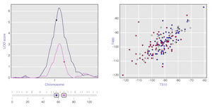
    </a>
  </td>
  <td class="right">
    <a href="example/scat2scat.html">
        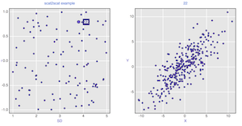
    </a>
  </td>
</tr>
<tr>
  <td class="left">
    <a href="example/itimeplot.html">
        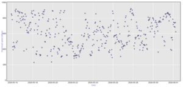
    </a>
  </td>
  <td class="right">
    <a href="example/iplot.html">
        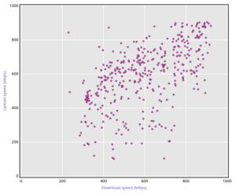
    </a>
  </td>
</tr>
<tr>
  <td class="left">
    <a href="example/itriplot.html">
        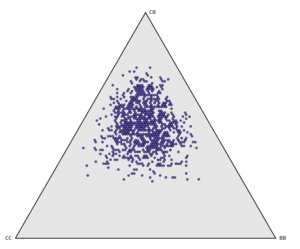
    </a>
  </td>
  <td class="right">
    <a href="example/idotplot.html">
        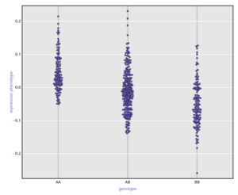
    </a>
  </td>
</tr>
<tr>
  <td class="left">
    <a href="example/iplotScantwo.html">
        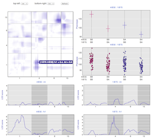
    </a>
  </td>
  <td class="right">
  </td>
</tr>
</table>

---

Sources on [github](https://github.com):

- The [source for the package](https://github.com/kbroman/qtlcharts/tree/main)
- The [source for the website](https://github.com/kbroman/qtlcharts/tree/gh-pages)
