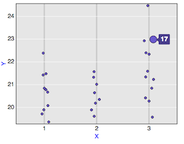
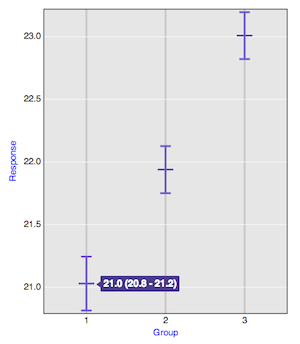
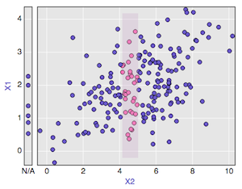
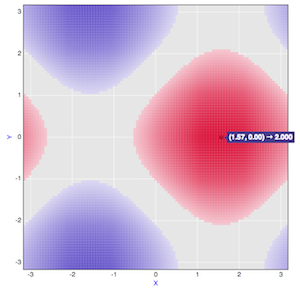
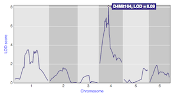
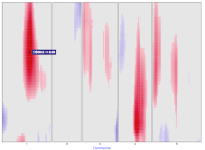
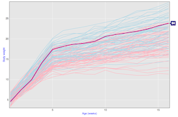
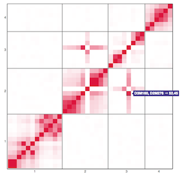
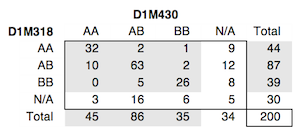

The interactive data visualizations produced by R/qtlcharts are
constructed from a series of reusable graphics panels, following
[Mike Bostock](http://bost.ocks.org/mike)'s
[Towards Reuseable Charts](http://bost.ocks.org/mike/chart/).

The intent is for these panel functions to be usable by others, for
other purposes, along the lines of
[d3.Chart](http://misoproject.com/d3-chart/), towards which I intend
to move.

---

Click on a panel for a corresponding interactive illustration.

<link href="../assets/css/image_table.css" rel="stylesheet" />

|                                                                                                    |                                                                                            |
| :------------------------------------------------------------------------------------------------: | :----------------------------------------------------------------------------------------: |
|           |      |
|  |         |
|           |  |
|     |      |
|     |   |
