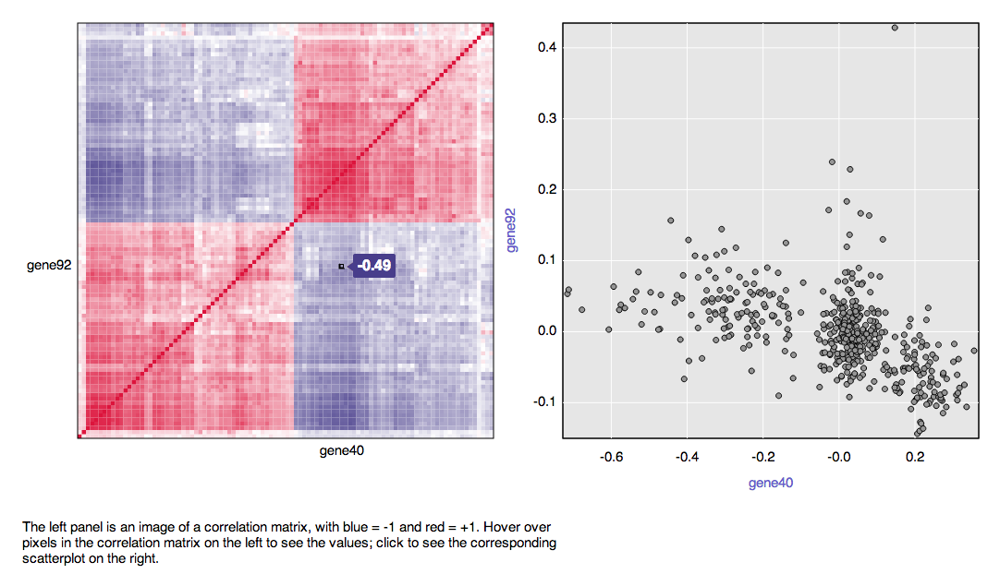
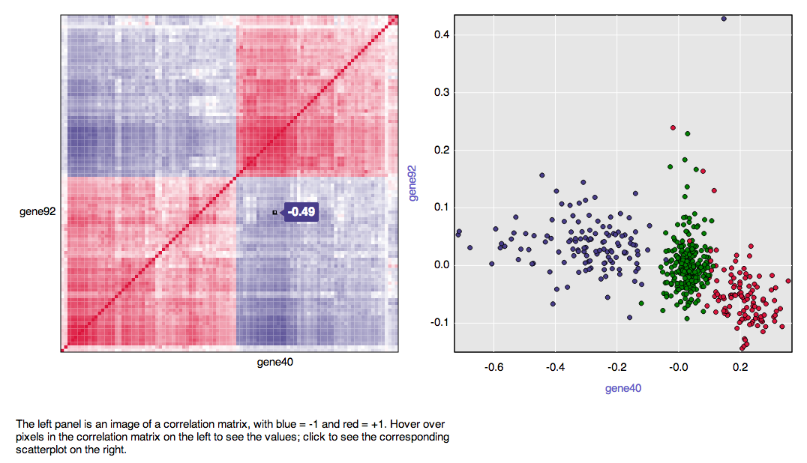

[R/qtlcharts](http://kbroman.org/qtlcharts) is an
[R](http://www.r-project.org) package to create interactive charts for
quantitative trait locus (QTL) mapping data, for use with [R/qtl](http://www.rqtl.org).

The charts are saved to a temporary file and opened in a web browser,
though you may also save them to a specific file, to be viewed later.
We are focusing development on the
[Chrome](http://www.google.com/chrome/browser) browser. The graphs may
also be viewed in other browsers, such as
[Safari](https://www.apple.com/safari/),
[Opera](http://www.opera.com/) and
[Firefox](http://www.mozilla.org/en-US/firefox/new/), but it can be
hard to accommodate all possible browser differences.

Information on installing R/qtlcharts is available
[here](http://kbroman.org/qtlcharts/pages/installation.html); it
requires installation of the packages [R/qtl](http://www.rqtl.org),
[htmlwidgets](http://htmlwidgets.org), and
[devtools](https://github.com/hadley/devtools).

## Basic use

You first need to load the package.

```{r load_library}
library(qtlcharts)
```

Let's begin by considering the function `iplotCorr`, which creates
a heatmap of a correlation matrix, linked to scatterplots of the
underlying variables.

We'll first load the `geneExpr` dataset, included with
the R/qtlcharts package.

```{r geneExpr_data}
data(geneExpr)
```

This is a list with two components. The first component, `geneExpr$expr`, is a
`r nrow(geneExpr$expr)` &times; `r ncol(geneExpr$expr)` matrix of gene
expression data; the second component, `geneExpr$genotype`, is a vector of
genotypes (of length `r length(geneExpr$genotype)`) at a QTL that
influences those `r ncol(geneExpr$expr)` genes' expression
values. (The genes were selected from a larger expression genetics study,
on that basis: that they are all influenced by this QTL.)

Let's pull out those two components of `geneExpr` as separate objects,
`expr` and `geno`.

```{r split_geneExpr}
expr <- geneExpr$expr
geno <- geneExpr$genotype
```

The simplest use of `iplotCorr` is with a numeric matrix, as with
the `expr` dataset. For example:

```{r iplotCorr_reordered, eval=FALSE}
iplotCorr(expr, reorder=TRUE)
```

This will open an interactive figure in a web browser, with a heat map
of the correlation matrix of the genes on the left linked to
the underlying scatterplots. With the argument `reorder=TRUE`, the genes
are reordered (by hierarchical clustering with the R function
`hclust`) to bring genes with similar expression patterns next to each
other.

The following is a snapshot. (See a live example at the
[R/qtlcharts website](http://kbroman.org/qtlcharts/example/iplotCorr.html).)



The left panel is a heat map of the correlation matrix. If you hover
over a pixel in the panel, the individual correlations are shown. If you
click on a pixel, the corresponding scatterplot is shown on the right.

We can have the scatterplot colored by the QTL genotypes contained in
the vector `geno`, through the `group` argument.

```{r iplotCorr_reordered_with_genotype, eval=FALSE}
iplotCorr(expr, geno, reorder=TRUE)
```

Here's a snapshot of the result.  (Again, see a live example at the
[R/qtlcharts website](http://kbroman.org/qtlcharts/example/iplotCorr.html).)



## Saving to a file

The interactive graphs produced by R/qtlcharts are, by default, saved
to a temporary file and then opened in the default web browser. If you
want to save a chart to a _particular_ file, assign the result to some
object and use the function `saveWidget()` in the
[htmlwidgets](http://htmlwidgets.org) package, as follows:

```{r iplotCorr_specify_file, eval=FALSE}
corrplot <- iplotCorr(expr, reorder=TRUE)
htmlwidgets::saveWidget(corrplot, file="~/Desktop/iplotCorr_example.html")
```

The chart will not be opened for viewing. If you wish to view the
chart, type the name of the object that you created, as so:

```{r iplotCorr_now_view, eval=FALSE}
corrplot
```

Charts saved with `saveWidget()` will, by default, contain all necessary code/resources.
A smaller file may be obtained by using `selfcontained=FALSE` in the
call to `saveWidget()`, in which case the external resources will be
placed in an adjacent directory.


## Chart customization options

There are a number of ways in which one may customize the
interactive graphs produced by
[R/qtlcharts](http://kbroman.org/qtlcharts), such as different
colors or axis labels. The main method for such customization
is through a function argument, `chartOpts`, which takes a named list.

For example, to change the dimensions of the image produced by
`iplotCorr`, use the `height` option, which specifies the height of
each panel in pixels; by default, each panel is square, with `width =
height`:


```{r iplotCorr_height, eval=FALSE}
iplotCorr(expr, reorder=TRUE, chartOpts=list(height=600))
```

If you want a different choice of color for the points in the scatterplot,
use `scatcolors`.

```{r iplotCorr_scatcolors, eval=FALSE}
iplotCorr(expr, reorder=TRUE,
          chartOpts=list(scatcolors="lightblue"))
```

You can modify both `height` and `scatcolors` at once.

```{r iplotCorr_height_and_scatcolors, eval=FALSE}
iplotCorr(expr, reorder=TRUE,
          chartOpts=list(height=600, scatcolors="lightblue"))
```

If the points are to be colored by genotype, you need to specify the
same number of colors as there are genotype groups.

```{r iplotCorr_multiscatcolors, eval=FALSE}
iplotCorr(expr, geno, reorder=TRUE,
          chartOpts=list(scatcolors=c("lightblue", "lightgreen", "pink")))
```

A full list of options is available in the
[`chartOpts` vignette](chartOpts.html):

```{r chartOpts_vignette, eval=FALSE}
vignette("chartOpts", "qtlcharts")
```


## Including a chart in an R Markdown document

The interactive charts may be included within an
[R Markdown](http://rmarkdown.rstudio.com/)-based
report. See the separate [`Rmarkdown` vignette](Rmarkdown.html):

```{r Rmarkdown_vignette, eval=FALSE}
vignette("Rmarkdown", "qtlcharts")
```


## Examples of the use of the charts

### `iplotCorr`

`iplotCorr` creates an heat map of a correlation matrix, linked to the
underlying scatterplots. We've shown a few examples above, but there
are several other features to consider.

By default, `iplotCorr` will calculate the correlation matrix to be
displayed, using Pearson's correlation; this can be sensitive to
outliers. If you wish to use a different statistic, provide the matrix
with the argument `corr`. For example, to use Spearman's rank correlation:

```{r iplotCorr_spearman, eval=FALSE}
data(geneExpr)
expr <- geneExpr$expr
geno <- geneExpr$genotype
spearman <- cor(expr, use="pairwise.complete.obs", method="spearman")

iplotCorr(expr, geno, corr=spearman)
```

If you provide your own correlation measure, the `reorder` argument is
ignored. If you want to reorder the genes, to bring correlated genes
together, you need to do it yourself. You can use `hclust` for this.

```{r iplotCorr_own_reorder, eval=FALSE}
ord <- hclust(as.dist(-spearman))$order
iplotCorr(expr[,ord], geno, corr=spearman[ord,ord])
```

You can view just a portion of the correlation matrix by specifying
`rows` and `cols`. For example, we could fit a regression line for
each gene, relating the expression pattern to the eQTL genotype, in
order to identify the genes with positive and negative associations
with genotype.

```{r get_eqtl_effect_est}
beta <- apply(expr, 2, function(y,x) lm(y~x)$coef[2], geno)
pos <- which(beta > 0)
neg <- which(beta < 0)
```

We could then look at just the portion of the correlation matrix where
the rows are genes with positive effects and the columns are genes
with negative effects.

```{r iplotCorr_subset_of_corr, eval=FALSE}
iplotCorr(expr, geno, rows=pos, cols=neg)
```

If you wish to use a different correlation statistic, you need to do
the subsetting in advance, as the `rows` and `cols` arguments are
ignored if `corr` is provided.

```{r iplotCorr_subset_of_spearman_corr, eval=FALSE}
iplotCorr(expr, geno, corr=spearman[pos,neg])
```
The connection between `expr` and `spearman[pos,neg]` is taken from
the column names of the former and both the row and column names of
the latter.


### `iplot`

`iplot` creates a simple, interactive scatterplot. Hover over a point
to view an identifier. Points may be colored according to some
provided group categories.

Let's simulate a bit of data, as an example.

```{r sim_data_iplot}
n <- 100
x <- rnorm(n)
grp <- sample(1:3, n, replace=TRUE)
y <- grp*x + rnorm(n)
```

We use `iplot` as follows.

```{r iplot_example, eval=FALSE}
iplot(x, y, grp)
```

The default is for the individual IDs to be simple sequential
numbers. We can include more detail by providing character strings.

```{r iplot_example_id, eval=FALSE}
id <- paste(seq(along=x), " x =", round(x,1), "  y =", round(y, 1), " group =", grp)
iplot(x, y, grp, id)
```

If you want to change the x- and y-axis labels, you need to use the
`chartOpts` argument. You can similarly change the point colors.

```{r iplot_chartOpts, eval=FALSE}
iplot(x, y, grp, id,
      chartOpts=list(xlab="x variable", ylab="y variable",
                     pointcolor=c("slateblue", "#999999", "violetred")))
```

### `iplotMap`

`iplotMap` creates an interactive genetic map. Hover over a
marker position to view the marker name. There's also a search box,
for searching for a particular marker.

Let's first load the `hyper` data included with
[R/qtl](http://www.rqtl.org) and pull out the genetic map with
`pull.map`. We need to load R/qtl, too.


```{r, load_hyper}
library(qtl)
data(hyper)
map <- pull.map(hyper)
```

We use `iplotMap` as follows.

```{r iplotMap_example, eval=FALSE}
iplotMap(map)
```

If you want to shift each chromosome so that the initial marker is at
0, use `shift=TRUE`.

```{r iplotMap_shift, eval=FALSE}
iplotMap(map, shift=TRUE)
```

`iplotMap` will also take a cross object, in which case it uses
`pull.map` to extract and then plot the map.

```{r iplotMap_w_cross, eval=FALSE}
iplotMap(hyper)
```

If you want to change the x- and y-axis labels, you need to use the
`chartOpts` argument:

```{r iplotMap_xylab, eval=FALSE}
iplotMap(map, chartOpts=list(xlab="Linkage group", ylab="Position (Mbp)"))
```

If you want to plot a subset of the chromosomes, use the `chr` argument:

```{r iplotMap_selected_chr, eval=FALSE}
iplotMap(map, chr=c(5, 10, 15, "X"))
```

You can use the chart option `title` to put a title centered above the
map panel.

```{r iplotMap_chartOpts_title, eval=FALSE}
iplotMap(map, chr=c(5, 10, 15, "X"),
         chartOpts=list(title="Selected chromosomes"))
```


### `iplotScanone`

`iplotScanone` creates an interactive chart with LOD
curves from a genome scan linked to estimated QTL effects.

Let's first load the `hyper` data, included with [R/qtl](http://www.rqtl.org)

```{r, load_hyper_and_scan}
data(hyper)
hyper <- calc.genoprob(hyper, step=1)
out <- scanone(hyper)
```

If you provide just the output from `scanone`, the only interactivity
is that hovering over marker positions on the LOD curves will give
information about the marker name, position, and LOD score.

```{r iplotScanone_example, eval=FALSE}
iplotScanone(out)
```

You can use the `chr` to plot only selected chromosomes.

```{r iplotScanone_selected_chr, eval=FALSE}
iplotScanone(out, chr=c(1, 4, 6, 15))
```

If you also provide the cross object, clicking on the markers will
generate a QTL effect plot on the right. By default, means with &plusmn; 1
SE error bars will be shown.

```{r iplotScanone_w_eff, eval=FALSE}
iplotScanone(out, hyper)
```

By default, in calculating the means and standard errors, a single
imputation is used to handle missing genotype information, using the
[R/qtl](http://www.rqtl.org) function `fill.geno`. Arguments may be
passed to `fill.geno` as a list, with the argument `fillgenoArgs`. For
example, to do the imputation by Viterbi, assuming a 1% genotyping
error rate, do the following:

```{r iplotScanone_fillgenoArgs, eval=FALSE}
iplotScanone(out, hyper, fillgenoArgs=list(method="argmax", error.prob=0.01))
```

If you want to plot raw phenotypes vs genotypes, rather than mean
&plusmn; SE, use `pxgtype="raw"`, as follows:

```{r iplotScanone_rawpxg, eval=FALSE}
iplotScanone(out, hyper, pxgtype="raw")
```

In the phenotype &times; genotype plot, pink points indicate that the
genotype was imputed.

To change the color of the LOD curves, use the `chartOpts` option
`lod_linecolor`. Colors are named as in html, or with hex RGB codes
like `"#842DCE"` or `#82C`. (See examples
[here](http://www.computerhope.com/htmcolor.htm) and a list of named
colors [here](http://html-color-codes.info/color-names/).)

```{r iplotScanone_lodlinecolor, eval=FALSE}
iplotScanone(out, hyper, chartOpts=list(lod_linecolor="black"))
```

You can change the background colors with the `chartOpts` options
`darkrect` and `lightrect`.

```{r iplotScanone_rectcolor, eval=FALSE}
iplotScanone(out, hyper, chartOpts=list(darkrect="#CCC", lightrect="#EEE"))
```

Change the colors of the lines in the mean &plusmn; SE plot with the
`chartOpts` option `eff_linecolor`.

```{r iplotScanone_efflinecolor, eval=FALSE}
iplotScanone(out, hyper, chartOpts=list(lod_linecolor="DarkViolet",
                                        eff_linecolor="DarkViolet"))
```


### `iplotMScanone`

`iplotMScanone` creates a heatmap of LOD curves for a set of genome
scans (for example, for each of a time course of phenotypes), linked to a
plot of the individual genome scans, and also to the QTL effects.

We'll consider the example dataset `grav`, included with R/qtlcharts.
These are data on seedling gravitropism in Arabidopsis recombinant
inbred lines; see
[Moore et al. (2013)](http://www.ncbi.nlm.nih.gov/pubmed/23979570). The
data are also available at the
[QTL archive](http://qtlarchive.org/db/q?pg=projdetails&proj=moore_2013b).

We first load the data.

```{r, grav_load_data}
data(grav)
```

We calculate QTL genotype probabilities across the genome, but reduce
these probabilities to a 1 cM grid.

```{r, grav_calc_genoprob}
grav <- calc.genoprob(grav, step=1)
grav <- reduce2grid(grav)
```

We'll perform a genome scan by Haley-Knott regression at each of the
`r nphe(grav)` time points.

```{r, grav_scanone}
phecol <- 1:nphe(grav)
out <- scanone(grav, phe=phecol)
```

If we pass the `scanone` output to `iplotMScanone`, we get a basic
plot.

```{r iplotMScanone_example, eval=FALSE}
iplotMScanone(out)
```

The upper-left panel is a heat map of the genome scans for each time
point. Hover over this panel, and the LOD curves for horizontal slices
(at specific time points) are shown below, and the LOD scores for
vertical slices (at a given genomic position, across time points) are
shown on the right.

The phenotypes here are measurements over time. The default result
uses a qualitative y-axis for the LOD heatmap in the upper-right.
We could instead have a quantitative y-axis scale by including the
times at which the phenotypes were measured. Currently, the time
points must be equally spaced.

The times at which the phenotypes were measured are included in the
`grav` dataset as an _attribute_, `"time"`.

```{r grab_grav_times}
times <- attr(grav, "time")
```

If we call `iplotMScanone` again with the `times` argument, we'll get
the quantitative y-axis scale. We can also include a y-axis label
using the chart option `lod_ylab`.

```{r iplotMScanone_w_times, eval=FALSE}
iplotMScanone(out, times=times, chartOpts=list(lod_ylab="Time (hrs)"))
```

We can use the function `estQTLeffects` to get estimated QTL effects at
each putative QTL position and for each time point.

```{r, grav_esteff}
eff <- estQTLeffects(grav, phe=phecol, what="effects")
```

If we pass both the genome scan results and the estimated QTL effects,
the heat map will display signed LOD scores (blue for negative effects
and red for positive effects) and QTL effects will be shown in the
upper-right panel.

```{r, iplotMScanone_with_effects, eval=FALSE}
iplotMScanone(out, effects=eff, times=times)
```

As an alternative to first calling `estQTLeffects`, you can pass the genome-scan
results and the cross object.

```{r, iplotMScanone_with_effects_alt, eval=FALSE}
iplotMScanone(out, grav, times=times)
```


### `iplotScantwo`

`iplotScantwo` creates an interactive plot of the output of the
[R/qtl](http://rqtl.org) function `scantwo`, of a two-dimensional,
two-QTL genome scan.

Let's first run `scantwo` using a coarse step size and focusing on
selected chromosomes. For the sake of speed, we'll use Haley-Knott
regression, even though it does not work well for selectively
genotyped data.

```{r scantwo}
data(hyper)
hyper <- hyper[c(1,4,6,15),]
hyper <- calc.genoprob(hyper, step=5)
out2 <- scantwo(hyper, method="hk", verbose=FALSE)
```

The simplest use of `iplotScantwo` is to just provide the `scantwo`
output, but it's best to also provide the QTL cross data, so that
QTL effect plots may be produced.

```{r iplotScantwo, eval=FALSE}
iplotScantwo(out2, hyper)
```

There are drop-down
menus to select which LOD scores to display in the heat map.
Hover over the heatmap to view the LOD scores, and click to
view cross-sectional slices below and the QTL effect plot to the
right.

You can control the size of the heatmap through the chart option
`pixelPerCell` &mdash; the number of pixels, in each direction, for each
small rectangle within the heatmap.

```{r iplotScantwo_bigger, eval=FALSE}
iplotScantwo(out2, hyper, chartOpts=list(pixelPerCell=12))
```

You can orient the plot with the diagonal going from the top-left to
the lower right (so that chromosome 1 is at the top rather
than at the bottom) using the chart option `oneAtTop`, as follows.

```{r iplotScantwo_oneAtTop, eval=FALSE}
iplotScantwo(out2, hyper, chartOpts=list(oneAtTop=TRUE))
```

The estimated QTL effects in the right-hand panels are derived
following a single imputation to fill in missing data, and so are a
bit crude.


### `iplotCurves`

`iplotCurves` creates a plot of a set of curves linked to one or two
scatterplots.

As an example, we'll again consider the phenotypes in the dataset `grav`,
included with R/qtlcharts.

```{r iplotCurves_data}
data(grav)
times <- attr(grav, "time")
phe <- grav$pheno
```

The object `phe` is an `r nrow(phe)`&times;`r ncol(phe)` matrix:
curves for `r nrow(phe)` individuals at `r ncol(phe)` time points,
with the time points specified by `times`.

The simplest use of `iplotCurves` is the following.

```{r iplotCurves_simple, eval=FALSE}
iplotCurves(phe)
```

This plots the rows of `phe` as a set of curves. If you hover over a
curve, it will be highlighted, and the individual ID (taken from the
rownames) will be displayed on the right. If the input matrix has no
row names, numeric indices are used.

The values on the x-axis are simply column indices. To use the
actual values in `times`, include it as a second argument.

```{r iplotCurves_wtimes, eval=FALSE}
iplotCurves(phe, times)
```

To change the axis labels, pass `curves_xlab` and `curves_ylab` using
`chartOpts`.

```{r iplotCurves_axislab, eval=FALSE}
iplotCurves(phe, times, chartOpts=list(curves_xlab="Time (hrs)",
                                       curves_ylab="Response"))
```

The `curves_` bit is to distinguish this panel from the
optional scatterplot panels; more on this below. You can use just
`xlab` and `ylab`, as follows.

```{r iplotCurves_axislabalt, eval=FALSE}
iplotCurves(phe, times, chartOpts=list(xlab="Time (hrs)",
                                       ylab="Response"))
```

More interesting is to have the curves linked to scatterplots, of
the response at particular times. For example, 2 hrs vs 4 hrs and 4
hrs vs 6 hrs. This is done by providing two-column matrices whose rows
correspond to the main matrix.

```{r iplotCurves_bigex, eval=FALSE}
iplotCurves(phe, times, phe[,times==2 | times==4], phe[,times==4 | times==6],
            chartOpts=list(curves_xlab="Time (hours)", curves_ylab="Response",
                           scat1_xlab="Angle at 2 hrs", scat1_ylab="Angle at 4 hrs",
                           scat2_xlab="Angle at 4 hrs", scat2_ylab="Angle at 6 hrs"))
```

You can also have just one linked scatterplot.

```{r iplotCurves_onescat, eval=FALSE}
iplotCurves(phe, times, phe[,times==2 | times==4],
            chartOpts=list(curves_xlab="Time (hours)", curves_ylab="Response",
                           scat1_xlab="Angle at 2 hrs", scat1_ylab="Angle at 4 hrs"))
```

You can also include a numeric vector of groups assignments for the
curves, to have groups of curves and points with common colors. For
example, we can pull out the genotype for a marker and color the
curves by their genotype. We'll use the `fill.geno` function in
[R/qtl](http://www.rqtl.org) to impute any missing genotypes.

```{r iplotCurves_groups, eval=FALSE}
g <- pull.geno(fill.geno(grav))[,"BF.206L-Col"]
iplotCurves(phe, times, phe[,times==2 | times==4], phe[,times==4 | times==6],
            group=g,
            chartOpts=list(curves_xlab="Time (hours)", curves_ylab="Response",
                           scat1_xlab="Angle at 2 hrs", scat1_ylab="Angle at 4 hrs",
                           scat2_xlab="Angle at 4 hrs", scat2_ylab="Angle at 6 hrs"))
```

To change the colors that are used in the plot, you need to provide a
vector of colors with the `chartOpts` options `strokecolor`, `strokecolorhilit`,
`pointcolor`, and `pointcolorhilit`. If you want the points and curves
to be the same, you can just use `color` and `colorhilit`.

```{r iplotCurves_colors, eval=FALSE}
iplotCurves(phe, times, phe[,times==2 | times==4], phe[,times==4 | times==6],
            group=g,
            chartOpts=list(curves_xlab="Time (hours)", curves_ylab="Response",
                           scat1_xlab="Angle at 2 hrs", scat1_ylab="Angle at 4 hrs",
                           scat2_xlab="Angle at 4 hrs", scat2_ylab="Angle at 6 hrs",
                           color=c("pink", "lightblue"), colorhilit=c("red", "blue")))
```


### `iboxplot`

`iboxplot` creates an interactive graph for a large set of box plots
(rendered as lines connecting the quantiles), linked to underlying
histograms.

Let's first simulate some data. These data are not particularly
interesting: 10,000 measurements from 500 normal distributions with a
common SD but shifts in the mean.

```{r iboxplot_simdata}
# simulated data
n.ind <- 500
n.gene <- 10000
mat <- matrix(rnorm(n.ind * n.gene, rnorm(n.ind, 5)), ncol=n.gene)
dimnames(mat) <- list(paste0("ind", 1:n.ind),
                      paste0("gene", 1:n.gene))
```

`iboxplot` expects a matrix, with the rows corresponding to
individuals and the columns corresponding to measurements; the plotted
boxplots will characterize the distributions in each row.

```{r iboxplot_example, eval=FALSE}
iboxplot(mat)
```

In the upper panel, each curve represents a particular quantile
and connects the values for the different individuals, who are
arranged along the x-axis. (By default, the individuals are sorted by
their median; use `orderByMedian=FALSE` to prevent this reordering.)
Hover over a different individuals and the corresponding histograms
are shown below. Click to have a particular histogram retained; click
again (if you can do so precisely!) to remove.

If you want to order the individuals in a different way, you need to
rearrange the rows of the matrix in advance and then use
`orderByMedian=FALSE`. For example, to order the individuals by their
99.9th percentiles, you could do:

```{r iboxplot_orderBy99, eval=FALSE}
iboxplot(mat[order(apply(mat, 1, quantile, 0.99)),], orderByMedian=FALSE)
```

By default, the function plots the 0.1, 1, 10, 25, and 50, 75, 90, 99,
and 99.9th percentiles. To plot a different set of percentiles, use
the argument `qu`, giving a vector of numeric values between 0 and
0.5. The median will always be included, and for every quantile $q$,
the corresponding $1-q$ quantile will be included as well.

To leave off the 0.1 and 99.9 percentiles, do the following.

```{r iboxplot_diff_quant, eval=FALSE}
iboxplot(mat, qu=c(0.25, 0.05, 0.01))
```

To use different colors for the quantile curves, include the option
`qucolors` through the `chartOpts` argument. The vector should have
length `length(qu)+1` (so, by default, 5). For each quantile $q$, the
same color is used for the corresponding quantile $1-q$. Here's an
example. The first color will correspond to the median, and then they
move from the inside out.

```{r iboxplot_qucolors, eval=FALSE}
iboxplot(mat, qu=c(0.25, 0.05, 0.01),
         chartOpts=list(qucolors=c("black", "green", "red", "blue")))
```

You can change the bins in the histograms in the lower panel through
the argument `breaks`. If a single numeric value, it indicates the
number of bins; if a vector, it indicates the endpoints for the bins.
The vector of breakpoints do not need to span the range of the data,
but a warning will be issued if they don't.

Here's an example specifying the number of bins.

```{r iboxplot_breaks, eval=FALSE}
iboxplot(mat, breaks=151)
```

Here's an example specifying actual bins. (This will issue a warning.)

```{r iboxplot_breaks2, eval=FALSE}
iboxplot(mat, breaks=seq(2, 8, by=0.1))
```

To change the axis labels, use the `chartOpts` options `xlab` and
`ylab`, for the x- and y-axes, respectively, in the top panel. The
y-axis label in the top panel will be used as the x-axis label in the
lower panel.

```{r iboxplot_axislab, eval=FALSE}
iboxplot(mat, chartOpts=list(xlab="Mice", ylab="Expression level"))
```

### `iheatmap`

`iheatmap` creates an interactive heatmap of a numeric matrix, with
pixels linked to plots of horizontal and vertical slices.

We'll first generate a set of data to plot:
$z(x,y) = x y \exp(-x^2 - y^2)$,
for $x,y \in [-2, 2]$

```{r iheatmap_data}
n <- 101
x <- y <- seq(-2, 2, len=n)
z <- matrix(ncol=n, nrow=n)
for(i in seq(along=x))
  for(j in seq(along=y))
    z[i,j] <- x[i]*y[j]*exp(-x[i]^2 - y[j]^2)
```

We can now call `iheatmap` with these data. The first argument is a
matrix with the $z$-values. The next two optional arguments are
vectors that indicate the $x$ and $y$ values.

```{r iheatmap_example, eval=FALSE}
iheatmap(z, x, y)
```

By default, the `iheatmap` takes as the range for the z-axis,
$[-M, M]$ where $M = \max |z|$. If you want a different range, you can use the
option `zlim` with `chartOpts`; you need to provide three values: the
minimum, the center, and the maximum. The color of the heatmap
can be controlled with the option `colors`; again this is a vector of
three values: the color for the minimum, the color for the middle
value, and the color for the maximum value.

Here's an example with expanded z-axis limits and different colors.

```{r iheatmap_diffcolors, eval=FALSE}
iheatmap(z, x, y,
         chartOpts=list(zlim=c(-1, 0, 1),
                        colors=c("purple", "white", "orangered")))
```

The labels for the axes can be controlled with the options `xlab`,
`ylab`, and `zlab`. Here's an example.

```{r iheatmap_axislab, eval=FALSE}
iheatmap(z, x, y, chartOpts=list(xlab="theta", ylab="psi", zlab="response"))
```

### `iplotRF`

`iplotRF` is an interactive version of the R/qtl function `plot.rf`,
a diagnostic plot of pairwise linkage between markers.

We'll look at the `badorder` dataset included with R/qtl. We first run
`est.rf` to estimate the recombination fraction between each pair of
markers and to further calculate a LOD score indicating evidence for
linkage for each marker pair.

```{r badorder_rf}
data(badorder)
badorder <- est.rf(badorder)
```

Making the plot is simple.

```{r iplotRF, eval=FALSE}
iplotRF(badorder)
```

The main plot is a heatmap of the LOD scores indicating pairwise
linkage; blue indicates large LOD score with recombination fraction <
1/2; red indicates large LOD score with recombination fraction > 1/2.
(Think: red is bad; blue is good.)
Hover over the heat map to view the LOD and recombination fraction
values. Click to generate additional views: to the right, a
cross-tabulation of two-locus genotypes for the pair of markers;
below, plots of the LOD scores for linkage, for the selected markers
versus every other marker across the genome.

Hover over the row and column headings in the cross-tab to view
conditional distributions (genotypes as percentages of the non-missing
observations; missing value as percentage of the total individuals).
Click on the points in the lower panels to refresh the cross-tab and
lower panels with the selected marker.

By default, the LOD scores in the heatmap are truncated at 12. This
can be changed with the chart option `lodlim`, which takes an
interval. Marker pairs with LOD below the lower limit will be omitted
from the heat map, which can give greater performance in the case of a
very large number of markers.

```{r iplotRF_lodlim, eval=FALSE}
iplotRF(badorder, chartOpts=list(lodlim=c(2, 15)))
```
